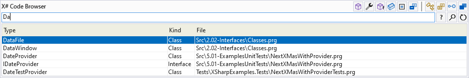
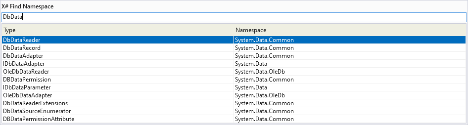

# X# PowerTools 2022

---------------------------------------

A set of Visual Studio 2022 tools for [X#](https://www.xsharp.eu) developers

## Getting started

Get the extension on the [Visual Studio Marketplace](https://marketplace.visualstudio.com/items?itemName=InfomindsAG.XSharpPowerTools).
Installation requires a minimum Visual Studio Version of 17.3 and a minimum X# Version of 2.9.

## Features

- Code Browser
- Find and insert Namespaces

The tools can be found under **Tools > X# Power Tools** or in the editors context menu.

There are no default shortcuts assigned, but you can easily assign shortcuts  yourself by following this [tutorial](https://docs.microsoft.com/en-us/visualstudio/ide/identifying-and-customizing-keyboard-shortcuts-in-visual-studio?view=vs-2019)

### Code Browser

The Code Browser allows to easily navigate within a solution containing X#-projects.

It offers a selection of wildcards to narrow down search results:

- example		- searches for types with names similar to 'example' (or members if no types are found)
- ex1.ex2		- searches for members similar to 'ex2' within types similar to 'ex1' ('.' equal to ':')
- .example	    - searches for members 'example' within all types
- ..example	    - searches for members 'example' within current type
- "example"     - matches whole word only
- ex*Model      - * is a placeholder for multiple characters

Alternatively the Code Browser offers filter options to ex- or include different kinds of either types or members. The filters can be activated and deactivated via Hotkeys. When holding Ctrl Code Browser shows a range of hints that display the available Hotkey combinations.

By pressing Return or double-clicking the implementation of the selected element will be opened in the editor.

By pressing Ctrl + Return or clicking the top-right button the found results are exported into a dockable Visual Studio Toolwindow where results are grouped by the containing project.

In the Visual Studio ToolWindow, the filters applied to the displayed search results can be edited in the Context Menu.

### Find and insert Namespaces

Find and insert Namespaces makes it easy to find the containing Namespace of a type and insert the corresponding using at the top of the document if necessary. If text is selected in the editor, Find Namespace will replace the selection with the type of the selected search result.

There is also the possibility of inserting the namespace reference with the type directly into your code when pressing Ctrl + Return.

